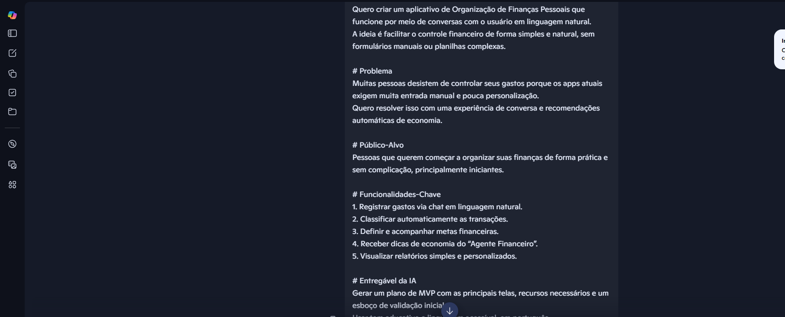
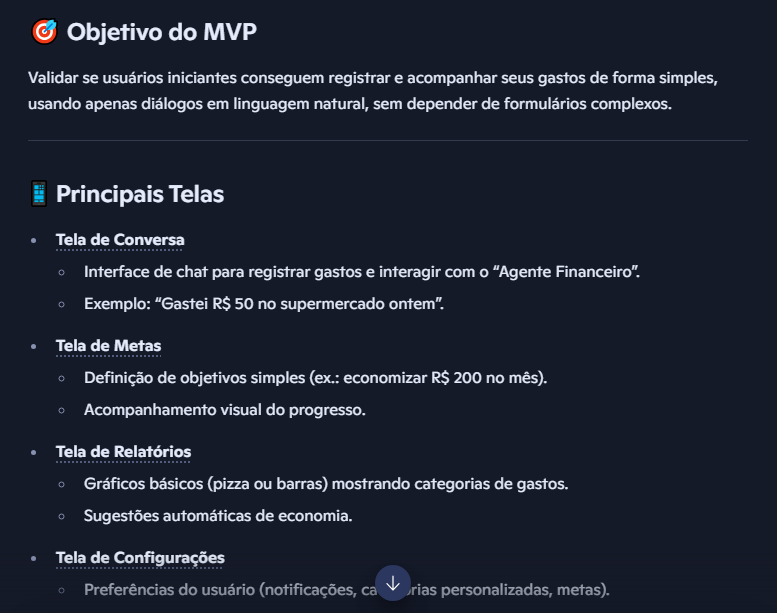

# 💸 App de Organização de Finanças Pessoais com Vibe Coding

## 🎯 Objetivo do MVP
Validar se usuários iniciantes conseguem registrar e acompanhar seus gastos de forma simples, usando apenas diálogos em linguagem natural, sem depender de formulários complexos.

## 📱 Principais Telas

* **Tela de Conversa:** Interface de chat para registrar gastos e interagir com o “Agente Financeiro” (exemplo: “Gastei R$ 50 no supermercado ontem”).
* **Tela de Metas:** Definição de objetivos simples (ex.: economizar R$ 200 no mês) e acompanhamento visual do progresso.
* **Tela de Relatórios:** Gráficos básicos (pizza ou barras) mostrando categorias de gastos e sugestões automáticas de economia.
* **Tela de Configurações:** Preferências do usuário (notificações, categorias personalizadas, metas).

## ⚙️ Recursos Necessários
* Processamento de linguagem natural para interpretar mensagens do usuário.
* Classificação automática de gastos por categoria.
* Banco de dados simples para armazenar transações e metas.
* Sistema de relatórios com visualizações básicas.
* Motor de recomendações para gerar dicas personalizadas.

## ✅ Validação Inicial
* **Teste com usuários reais:** Convidar 10–20 pessoas iniciantes em controle financeiro.
* **Métricas de uso:** Frequência de registro de gastos, engajamento com metas e relatórios.
* **Feedback qualitativo:** Entender se a experiência de conversa é mais prática que planilhas ou apps tradicionais.
* **Iteração rápida:** Ajustar categorias, relatórios e dicas conforme os testes.

---

## 🖼️ Evidências e Telas

---

## 🚀 3. Entregando o Desafio na DIO

### 💸 App de Organização de Finanças Pessoais

#### 📖 Resumo
Este aplicativo ajuda pessoas iniciantes a organizar suas finanças de forma prática e acessível. A proposta é substituir formulários complexos e planilhas por uma experiência de conversa natural, onde o usuário interage com um “Agente Financeiro” para registrar gastos, definir metas e receber recomendações de economia.

#### 🚀 O que o App Faz
* **Registrar gastos via chat:** O usuário informa seus gastos em linguagem natural, como “Gastei R$ 50 no supermercado ontem”.
* **Classificação automática:** O sistema organiza os gastos em categorias sem esforço manual.
* **Definir metas financeiras:** O usuário cria objetivos simples, como economizar um valor específico no mês.
* **Relatórios acessíveis:** Gráficos básicos e descrições textuais mostram onde o dinheiro está sendo gasto.
* **Dicas de economia:** Recomendações personalizadas para ajudar o usuário a gastar melhor.
* **Design universal:** Interface inclusiva, com opções de acessibilidade como fonte ajustável, modo alto contraste e suporte a leitores de tela.

#### Reflexão sobre o Processo
* **O app funcionou bem?** Sim, o app funcionou bem e a forma que a conversa com o Lovable ocorreu foi simples e fluida, sem a necessidade de saber programação.
* **O que não funcionou como o esperado?** Eu tive que aprender a utilizar várias IAs para atingir meu objetivo final.
* **O que aprendeu sobre conversar com IAs?** As IAs podem ser muito úteis desde que se usem da forma correta.

---

## 💬 Conclusão

Vibe Coding é sobre clareza, curiosidade e criatividade, não sobre perfeição técnica. O verdadeiro objetivo aqui é aprender a pensar junto com a IA, transformando ideias em conceitos reais e enxergando a tecnologia como uma extensão do seu raciocínio criativo. Cada interação é um experimento; quanto mais clara for sua intenção, mais surpreendente será o resultado.
